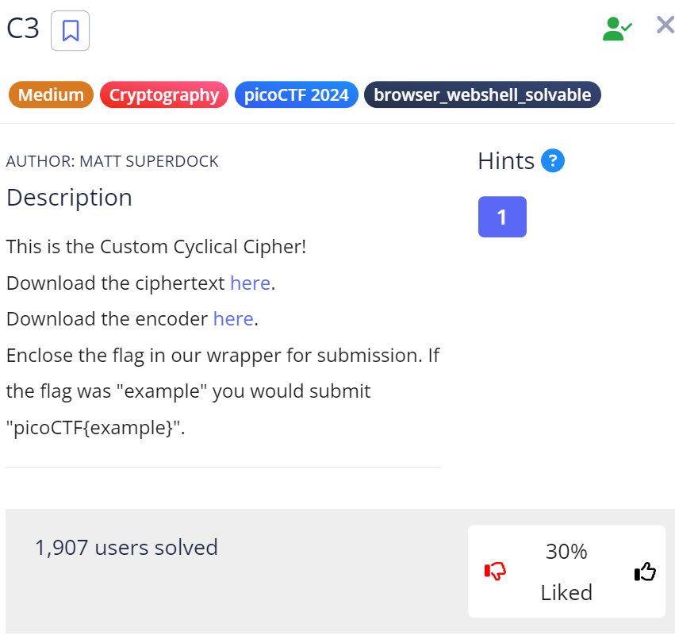

"Cryptography" Challenge

We are given a file which tells us how the plaintext was encoded. We easily reverse this to get the code in outp.py printed as text.

We then have to infer that the 4 comments above are a hint that we should use this code as the input for the code itself, which then prints out 

```
a
d
l
i
b
s
```

And that is the flag. PicoCTF{adlibs}
This is stupid, and I am not alone, judging by the rating

