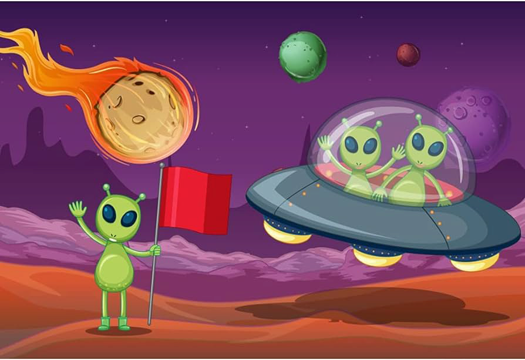
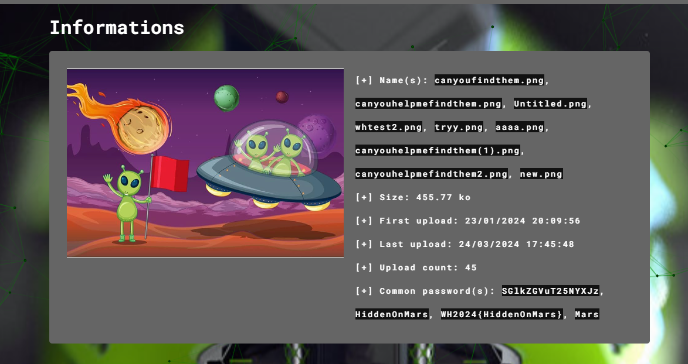
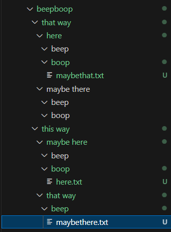
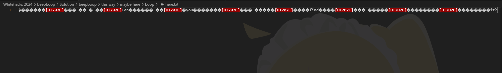

Forensics Challenge

In this challenge, we are given a file that png file that will not open. Opening it in an online hex editor, we find that the header seems a bit off.


as compared to a normal one (fixed version in this case)


Changing the bytes of the first line and correcting the header allows us to open the image.



Running this through aperisolve we get a lot of information. Firstly, we see



that other participants have ran this image through aperisolve already, and they have attempted to input passwords of what appears to be a hash and HiddenOnMars.
Ignoring that for now, we scroll down to see that zsteg has found something


Huh. That is one of the passwords input. Running this through hash identifiers and decrypting base64 online confirms our suspicious, it was a base64 string of HiddenOnMars. Attempting to enter this wrapped in the flag format gives us a wrong answer, so we try again. We attempt what the others have and attempt to run aperisolve on this with the password HiddenOnMars, to find that nothing changed.

This is the part where I struggled the most because I am simply blind. I was stuck at this point for so long, and after revisiting the challenge, I realised that I missed something. Binwalk has found something for us.


Downloading this gives us a few folders, and renaming the one with the largest file name in hex to a zip allows us to see that it was in fact a zip.
We attempt to extract the files but it asked for a password, so we attempt to put in HiddenOnMars. This suceeded and gave us a list of nested files.



We take a look through the txt files to see here.txt gave us many whitespaces (more apparent when opened through notepad)



Remembering the recent CTF LagNCrash challenges I identified this as a zero width space character that is used to hide text. Running the text through https://330k.github.io/misc_tools/unicode_steganography.html finall gives us a long list of binary numbers

```
01010111 01001000 00110010 00110000 00110010 00110100 01111011 00110000 01001101 01100111 01011111 01111001 00110000 01110101 01011111 01100110 00110000 01110101 01101110 01000100 01011111 01101101 01011001 01011111 01100110 01110010 01101001 01100101 01001110 01000100 00110101 01111101
```

Running this through an online binary to text converter like https://www.rapidtables.com/convert/number/binary-to-ascii.html gives us the flag WH2024{0Mg_y0u_f0unD_mY_frieND5}

Upon looking through the folders after solving it, I found that there was in fact hints to what to do with the zero width space string.


Overall, solid challenge. Long forens chal/10